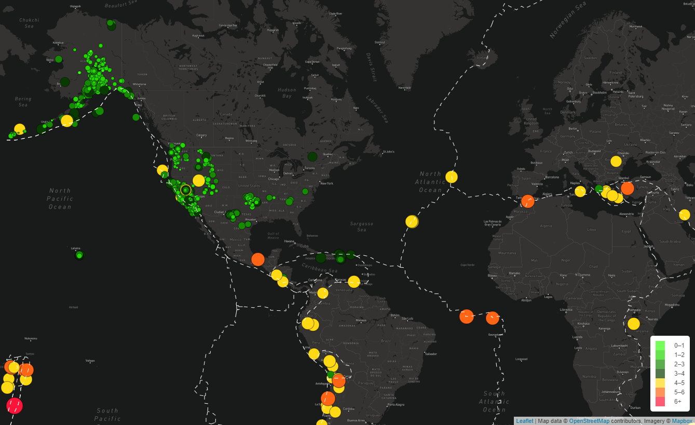

# Module 13: Mapping Earthquakes Using JS's Leaflet & D3 with APIs 

## Resourses:

**Software:** Javascipt, CSS, HTML, D3, Mapbox API, Leaflet

**Data Sources GeoJSON Files:** 
  - Github: 
    - https://raw.githubusercontent.com/fraxen/tectonicplates/master/GeoJSON/PB2002_boundaries.json
  - US Geological Survey: 
    - https://earthquake.usgs.gov/earthquakes/feed/v1.0/summary/all_week.geojson
    - https://earthquake.usgs.gov/earthquakes/feed/v1.0/summary/4.5_week.geojso

## Summary:
Using JavaScript's Leaflet and D3 libraries along with Mapbox's API, I populated a geographical map using GeoJSON earthquake data from the U.S. Geological Survey URL.  Each earthquake is visually represented by a color and a circle, where a higher magnitude has a larger diameter and is darker in color. Major earthquakes are designated by using yellow, orange, and red colors. 

By utilizing Leaflet control plugins to add user interface controls, each earthquake has a popup marker that, when clicked, shows the magnitude and the location of the earthquake. The user may utilize the top right-hand corner to select a variety of map types and different event filters.

